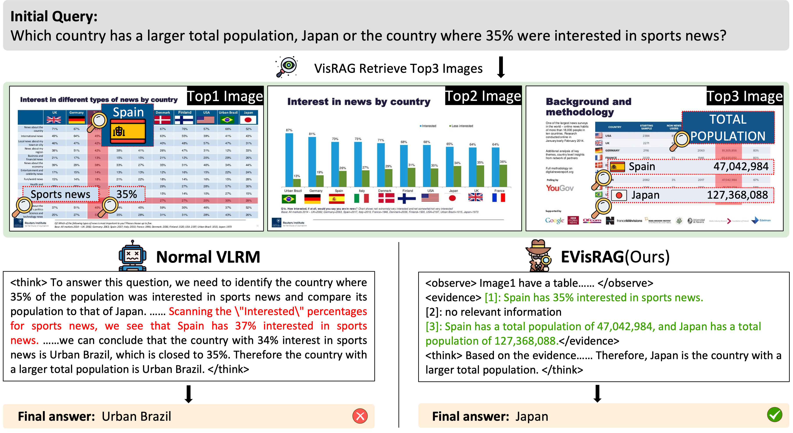
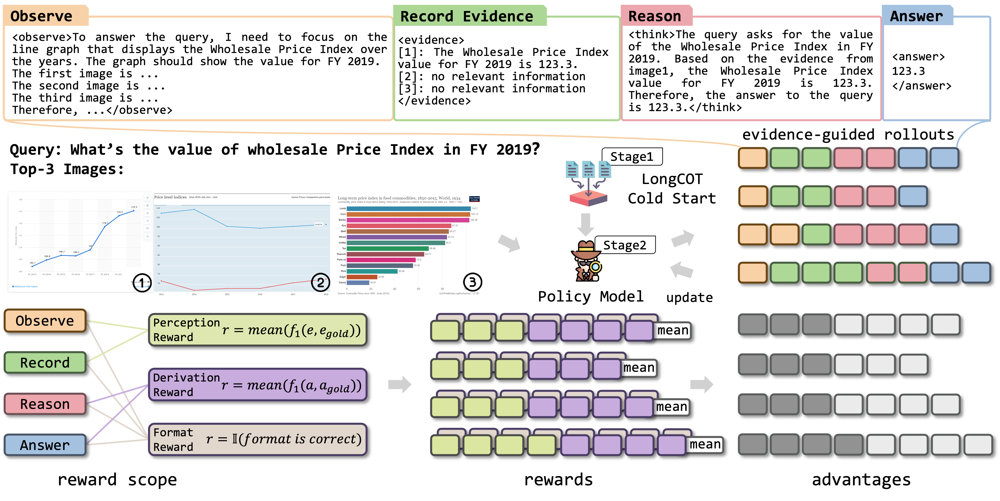

# VisRAG 2.0: Evidence-Guided Multi-Image Reasoning in Visual Retrieval-Augmented Generation
[](https://github.com/OpenBMB/VisRAG)
[](https://arxiv.org/abs/2510.09733)
[](https://arxiv.org/abs/2410.10594)
[](https://huggingface.co/Boggy666/EVisRAG-7B)
[](https://huggingface.co/openbmb/VisRAG-Ret)
[](https://huggingface.co/collections/openbmb/visrag-6717bbfb471bb018a49f1c69)
[](https://huggingface.co/spaces/tcy6/VisRAG_Pipeline)
[](https://colab.research.google.com/drive/11KV9adDNXPfHiuFAfXNOvtYJKcyR8JZH?usp=sharing)

<p align="center">•
 <a href="#-introduction"> 📖 Introduction </a> •
 <a href="#-news">🎉 News</a> •
 <a href="#-visrag-pipeline">✨ VisRAG Pipeline</a> •
 <a href="#%EF%B8%8F-setup">⚙️ Setup</a> •
 <a href="#%EF%B8%8F-training">⚡️ Training</a> 
</p>
<p align="center">•
 <a href="#-evaluation">📃 Evaluation</a> •
 <a href="#-usage">🔧 Usage</a> •
 <a href="#-license">📄 Lisense</a> •
 <a href="#-contact">📧 Contact</a> •
 <a href="#-star-history">📈 Star History</a>
</p>

# 📖 Introduction
**EVisRAG (VisRAG 2.0)** is an evidence-guided Vision Retrieval-augmented Generation framework that equips VLMs for multi-image questions by first linguistically observing retrieved images to collect per-image evidence, then reasoning over those cues to answer. **EVisRAG** trains with Reward-Scoped GRPO, applying fine-grained token-level rewards to jointly optimize visual perception and reasoning.

<p align="center"></p>


**VisRAG** is a novel vision-language model (VLM)-based RAG pipeline. In this pipeline, instead of first parsing the document to obtain text, the document is directly embedded using a VLM as an image and then retrieved to enhance the generation of a VLM. Compared to traditional text-based RAG, **VisRAG** maximizes the retention and utilization of the data information in the original documents, eliminating the information loss introduced during the parsing process.

<p align="center"></p>

# 🎉 News

* 20251118: Both EVisRAG and VisRAG can be easily reproduced within [UltraRAG v2](https://github.com/OpenBMB/UltraRAG).
* 20251022: We upload all evaluation benchmarks in [VisRAG Collections](https://huggingface.co/collections/openbmb/visrag-6717bbfb471bb018a49f1c69) 
* 20251020: We upload a temporary [EVisRAG-Train](https://huggingface.co/datasets/hmhm1229/EVisRAG-Train) on Hugging Face.
* 20251018: We add a temporary [model repo](https://huggingface.co/Boggy666/EVisRAG-7B) on Hugging Face.
* 20251014: Released [EVisRAG-3B](https://huggingface.co/openbmb/EVisRAG-3B) on HuggingFace.
* 20251014: Released **EVisRAG (VisRAG 2.0)**, an end-to-end Vision-Language Model. Released our [Paper](https://arxiv.org/abs/2510.09733) on arXiv. Released our [Model](https://huggingface.co/openbmb/EVisRAG-7B) on HuggingFace. Released our [Code](https://github.com/OpenBMB/VisRAG) on GitHub
* 20241111: Released our [VisRAG Pipeline](https://github.com/OpenBMB/VisRAG/tree/master/visrag_scripts/demo/visrag_pipeline) on GitHub, now supporting visual understanding across multiple PDF documents.
* 20241104: Released our [VisRAG Pipeline](https://huggingface.co/spaces/tcy6/VisRAG_Pipeline) on Hugging Face Space.
* 20241031: Released our [VisRAG Pipeline](https://colab.research.google.com/drive/11KV9adDNXPfHiuFAfXNOvtYJKcyR8JZH?usp=sharing) on Colab. Released codes for converting files to images, which could be found at `visrag_scripts/file2img`.
* 20241015: Released our train data and test data on Hugging Face which can be found in the [VisRAG](https://huggingface.co/collections/openbmb/visrag-6717bbfb471bb018a49f1c69) Collection on Hugging Face. It is referenced at the beginning of this page.
* 20241014: Released our [Paper](https://arxiv.org/abs/2410.10594) on arXiv. Released our [Model](https://huggingface.co/openbmb/VisRAG-Ret) on Hugging Face. Released our [Code](https://github.com/OpenBMB/VisRAG) on GitHub.

# ✨ VisRAG Pipeline
## EVisRAG

**EVisRAG** is an end-to-end framework that equips VLMs with precise visual perception during reasoning in multi-image scenarios. We trained and released VLRMs with EVisRAG built on [Qwen2.5-VL-7B-Instruct](https://huggingface.co/Qwen/Qwen2.5-VL-7B-Instruct), and [Qwen2.5-VL-3B-Instruct](https://huggingface.co/Qwen/Qwen2.5-VL-3B-Instruct).

## VisRAG-Ret

**VisRAG-Ret** is a document embedding model built on [MiniCPM-V 2.0](https://huggingface.co/openbmb/MiniCPM-V-2), a vision-language model that integrates [SigLIP](https://huggingface.co/google/siglip-so400m-patch14-384) as the vision encoder and [MiniCPM-2B](https://huggingface.co/openbmb/MiniCPM-2B-sft-bf16) as the language model.

## VisRAG-Gen

In the paper, we use MiniCPM-V 2.0, MiniCPM-V 2.6, and GPT-4o as the generators. Actually, you can use any VLMs you like!

# ⚙️ Setup
## EVisRAG
```bash
git clone https://github.com/OpenBMB/VisRAG.git
conda create --name EVisRAG python==3.10
conda activate EVisRAG
cd EVisRAG
pip install -r EVisRAG_requirements.txt
```
## VisRAG
```bash
git clone https://github.com/OpenBMB/VisRAG.git
conda create --name VisRAG python==3.10.8
conda activate VisRAG
conda install nvidia/label/cuda-11.8.0::cuda-toolkit
cd VisRAG
pip install -r requirements.txt
pip install -e .
cd timm_modified
pip install -e .
cd ..
```
Note:
1. `timm_modified` is an enhanced version of the `timm` library that supports gradient checkpointing, which we use in our training process to reduce memory usage.

# ⚡️ Training
## EVisRAG

To train EVisRAG effectively, we introduce Reward-Scoped Group Relative Policy Optimization (RS-GRPO), which binds fine-grained rewards to scope-specific tokens to jointly optimize visual perception and reasoning abilities of VLMs.

<p align="center"></p>

***Stage1: SFT*** (based on [LLaMA-Factory](https://github.com/hiyouga/LLaMA-Factory))

```bash
git clone https://github.com/hiyouga/LLaMA-Factory.git 
bash evisrag_scripts/full_sft.sh
```

***Stage2: RS-GRPO*** (based on [Easy-R1](https://github.com/hiyouga/EasyR1))

```bash
bash evisrag_scripts/run_rsgrpo.sh
```

Notes:

1. The training data is available on Hugging Face under `EVisRAG-Train`, which is referenced at the beginning of this page.
2. We adopt a two-stage training strategy. In the first stage, please clone `LLaMA-Factory` and update the model path in the full_sft.sh script. In the second stage, we built our customized algorithm `RS-GRPO` based on `Easy-R1`, specifically designed for EVisRAG, whose implementation can be found in `src/RS-GRPO`.

## VisRAG-Ret

Our training dataset of 362,110 Query-Document (Q-D) Pairs for **VisRAG-Ret** is comprised of train sets of openly available academic datasets (34%) and a synthetic dataset made up of pages from web-crawled PDF documents and augmented with VLM-generated (GPT-4o) pseudo-queries (66%). 

```bash
bash visrag_scripts/train_retriever/train.sh 2048 16 8 0.02 1 true false config/deepspeed.json 1e-5 false wmean causal 1 true 2 false <model_dir> <repo_name_or_path>
```
Note:
1. Our training data can be found in the `VisRAG` collection on Hugging Face, referenced at the beginning of this page. Please note that we have separated the `In-domain-data` and `Synthetic-data` due to their distinct differences. If you wish to train with the complete dataset, you’ll need to merge and shuffle them manually.
2. The parameters listed above are those used in our paper and can be used to reproduce the results.
3. `<repo_name_or_path>` can be any of the following: `openbmb/VisRAG-Ret-Train-In-domain-data`, `openbmb/VisRAG-Ret-Train-Synthetic-data`, the directory path of a repository downloaded from `Hugging Face`, or the directory containing your own training data.
4. If you wish to train using your own datasets, remove the `--from_hf_repo` line from the `train.sh` script. Additionally, ensure that your dataset directory contains a `metadata.json` file, which must include a `length` field specifying the total number of samples in the dataset.
5. Our training framework is modified based on [OpenMatch](https://github.com/OpenMatch/OpenMatch).

## VisRAG-Gen

The generation part does not use any fine-tuning, we directly use off-the-shelf LLMs/VLMs for generation.

# 📃 Evaluation
## EVisRAG
```bash
bash evisrag_scripts/predict.sh
bash evisrag_scripts/eval.sh 
```

Notes:

1. The test data is available on Hugging Face under `EVisRAG-Test-xxx`, as referenced at the beginning of this page.
2. To run evaluation, first execute the `predict.sh` script. The model outputs will be saved in the preds directory. Then, use the `eval.sh` script to evaluate the predictions. The metrics `EM`, `Accuracy`, and `F1` will be reported directly.

## VisRAG-Ret

```bash
bash visrag_scripts/eval_retriever/eval.sh 512 2048 16 8 wmean causal ArxivQA,ChartQA,MP-DocVQA,InfoVQA,PlotQA,SlideVQA <ckpt_path>
```

Note: 
1. Our test data can be found in the `VisRAG` Collection on Hugging Face, which is referenced at the beginning of this page.
2. The parameters listed above are those used in our paper and can be used to reproduce the results.
3. The evaluation script is configured to use datasets from Hugging Face by default. If you prefer to evaluate using locally downloaded dataset repositories, you can modify the `CORPUS_PATH`, `QUERY_PATH`, `QRELS_PATH` variables in the evaluation script to point to the local repository directory.

## VisRAG-Gen
There are three settings in our generation: text-based generation, single-image-VLM-based generation and multi-image-VLM-based generation. Under single-image-VLM-based generation, there are two additional settings: page concatenation and weighted selection. For detailed information about these settings, please refer to our paper.
```bash
python visrag_scripts/generate/generate.py \
--model_name <model_name> \
--model_name_or_path <model_path> \
--dataset_name <dataset_name> \
--dataset_name_or_path <dataset_path> \
--rank <process_rank> \ 
--world_size <world_size> \
--topk <number of docs retrieved for generation> \
--results_root_dir <retrieval_results_dir> \
--task_type <task_type> \
--concatenate_type <image_concatenate_type> \
--output_dir <output_dir>
```
Note:
1. `use_positive_sample` determines whether to use only the positive document for the query. Enable this to exclude retrieved documents and omit `topk` and `results_root_dir`. If disabled, you must specify `topk` (number of retrieved documents) and organize `results_root_dir` as `results_root_dir/dataset_name/*.trec`.
2. `concatenate_type` is only needed when `task_type` is set to `page_concatenation`. Omit this if not required.
3. Always specify `model_name_or_path`, `dataset_name_or_path`, and `output_dir`.
4. Use `--openai_api_key` only if GPT-based evaluation is needed.

# 🔧 Usage
## EVisRAG

Model on Hugging Face: https://huggingface.co/openbmb/EVisRAG-7B

```python
from transformers import AutoProcessor
from vllm import LLM, SamplingParams
from qwen_vl_utils import process_vision_info

def evidence_promot_grpo(query):
    return f"""You are an AI Visual QA assistant. I will provide you with a question and several images. Please follow the four steps below:

Step 1: Observe the Images
First, analyze the question and consider what types of images may contain relevant information. Then, examine each image one by one, paying special attention to aspects related to the question. Identify whether each image contains any potentially relevant information.
Wrap your observations within <observe></observe> tags.

Step 2: Record Evidences from Images
After reviewing all images, record the evidence you find for each image within <evidence></evidence> tags.
If you are certain that an image contains no relevant information, record it as: [i]: no relevant information(where i denotes the index of the image).
If an image contains relevant evidence, record it as: [j]: [the evidence you find for the question](where j is the index of the image).

Step 3: Reason Based on the Question and Evidences
Based on the recorded evidences, reason about the answer to the question.
Include your step-by-step reasoning within <think></think> tags.

Step 4: Answer the Question
Provide your final answer based only on the evidences you found in the images.
Wrap your answer within <answer></answer> tags.
Avoid adding unnecessary contents in your final answer, like if the question is a yes/no question, simply answer "yes" or "no".
If none of the images contain sufficient information to answer the question, respond with <answer>insufficient to answer</answer>.

Formatting Requirements:
Use the exact tags <observe>, <evidence>, <think>, and <answer> for structured output.
It is possible that none, one, or several images contain relevant evidence.
If you find no evidence or few evidences, and insufficient to help you answer the question, follow the instruction above for insufficient information.

Question and images are provided below. Please follow the steps as instructed.
Question: {query}
"""

model_path = "xxx"
processor = AutoProcessor.from_pretrained(model_path, trust_remote_code=True, padding_side='left')

imgs, query = ["imgpath1", "imgpath2", ..., "imgpathX"], "What xxx?"
input_prompt = evidence_promot_grpo(query)

content = [{"type": "text", "text": input_prompt}]
for imgP in imgs:
    content.append({
        "type": "image",
        "image": imgP
    })
msg = [{
          "role": "user",
          "content": content,
      }]

llm = LLM(
    model=model_path,
    tensor_parallel_size=1,
    dtype="bfloat16",
    limit_mm_per_prompt={"image":5, "video":0},
)

sampling_params = SamplingParams(
    temperature=0.1,
    repetition_penalty=1.05,
    max_tokens=2048,
)

prompt = processor.apply_chat_template(
    msg,
    tokenize=False,
    add_generation_prompt=True,
)

image_inputs, _ = process_vision_info(msg)

msg_input = [{
    "prompt": prompt,
    "multi_modal_data": {"image": image_inputs},
}]

output_texts = llm.generate(msg_input,
    sampling_params=sampling_params,
)

print(output_texts[0].outputs[0].text)
```


## VisRAG-Ret

Model on Hugging Face: https://huggingface.co/openbmb/VisRAG-Ret

```python
from transformers import AutoModel, AutoTokenizer
import torch
import torch.nn.functional as F
from PIL import Image
import os

def weighted_mean_pooling(hidden, attention_mask):
    attention_mask_ = attention_mask * attention_mask.cumsum(dim=1)
    s = torch.sum(hidden * attention_mask_.unsqueeze(-1).float(), dim=1)
    d = attention_mask_.sum(dim=1, keepdim=True).float()
    reps = s / d
    return reps

@torch.no_grad()
def encode(text_or_image_list):
    
    if (isinstance(text_or_image_list[0], str)):
        inputs = {
            "text": text_or_image_list,
            'image': [None] * len(text_or_image_list),
            'tokenizer': tokenizer
        }
    else:
        inputs = {
            "text": [''] * len(text_or_image_list),
            'image': text_or_image_list,
            'tokenizer': tokenizer
        }
    outputs = model(**inputs)
    attention_mask = outputs.attention_mask
    hidden = outputs.last_hidden_state

    reps = weighted_mean_pooling(hidden, attention_mask)   
    embeddings = F.normalize(reps, p=2, dim=1).detach().cpu().numpy()
    return embeddings

model_name_or_path = "openbmb/VisRAG-Ret"
tokenizer = AutoTokenizer.from_pretrained(model_name_or_path, trust_remote_code=True)
model = AutoModel.from_pretrained(model_name_or_path, torch_dtype=torch.bfloat16, trust_remote_code=True)
model.eval()

script_dir = os.path.dirname(os.path.realpath(__file__))
queries = ["What does a dog look like?"]
passages = [
    Image.open(os.path.join(script_dir, 'test_image/cat.jpeg')).convert('RGB'),
    Image.open(os.path.join(script_dir, 'test_image/dog.jpg')).convert('RGB'),
]

INSTRUCTION = "Represent this query for retrieving relevant documents: "
queries = [INSTRUCTION + query for query in queries]

embeddings_query = encode(queries)
embeddings_doc = encode(passages)

scores = (embeddings_query @ embeddings_doc.T)
print(scores.tolist())
```
## VisRAG-Gen
For `VisRAG-Gen`, you can explore the `VisRAG Pipeline` on Google Colab which includes both `VisRAG-Ret` and `VisRAG-Gen` to try out this simple demonstration.


# 📄 License

* The code in this repo is released under the [Apache-2.0](https://github.com/OpenBMB/MiniCPM/blob/main/LICENSE) License. 
* The usage of **VisRAG-Ret** model weights must strictly follow [MiniCPM Model License.md](https://github.com/OpenBMB/MiniCPM/blob/main/MiniCPM%20Model%20License.md).
* The models and weights of **VisRAG-Ret** are completely free for academic research. After filling out a ["questionnaire"](https://modelbest.feishu.cn/share/base/form/shrcnpV5ZT9EJ6xYjh3Kx0J6v8g) for registration, **VisRAG-Ret** weights are also available for free commercial use.

# 📧 Contact
## EVisRAG
- Yubo Sun: syb2000417@stu.pku.edu.cn
- Chunyi Peng: hm.cypeng@gmail.com
## VisRAG
- Shi Yu: yus21@mails.tsinghua.edu.cn
- Chaoyue Tang: tcy006@gmail.com

# 📈 Star History

<a href="https://star-history.com/#openbmb/VisRAG&Date">
 <picture>
   <source media="(prefers-color-scheme: dark)" srcset="https://api.star-history.com/svg?repos=openbmb/VisRAG&type=Date&theme=dark" />
   <source media="(prefers-color-scheme: light)" srcset="https://api.star-history.com/svg?repos=openbmb/VisRAG&type=Date" />
   
 </picture>
</a>
